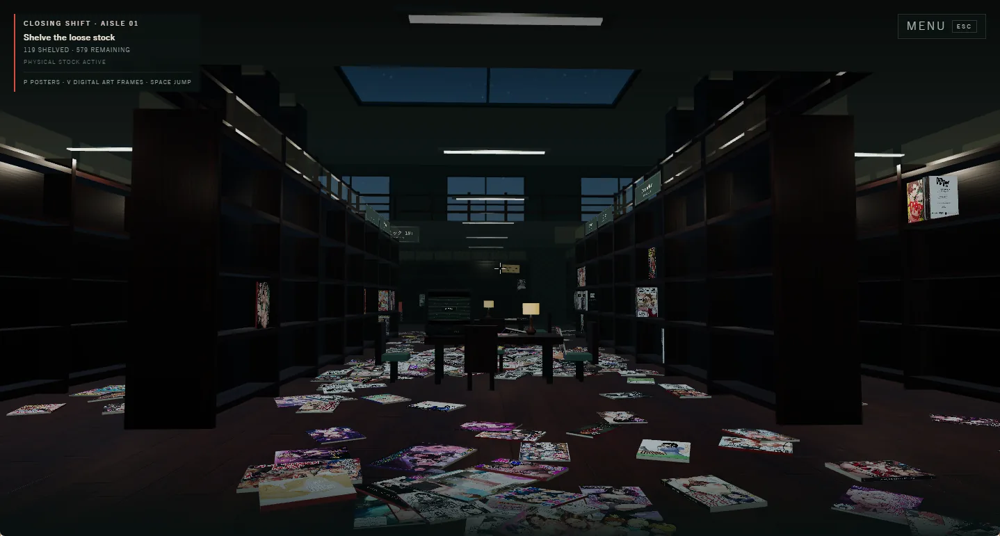
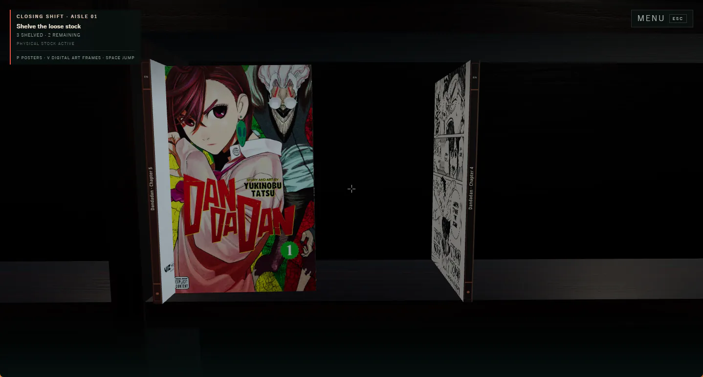
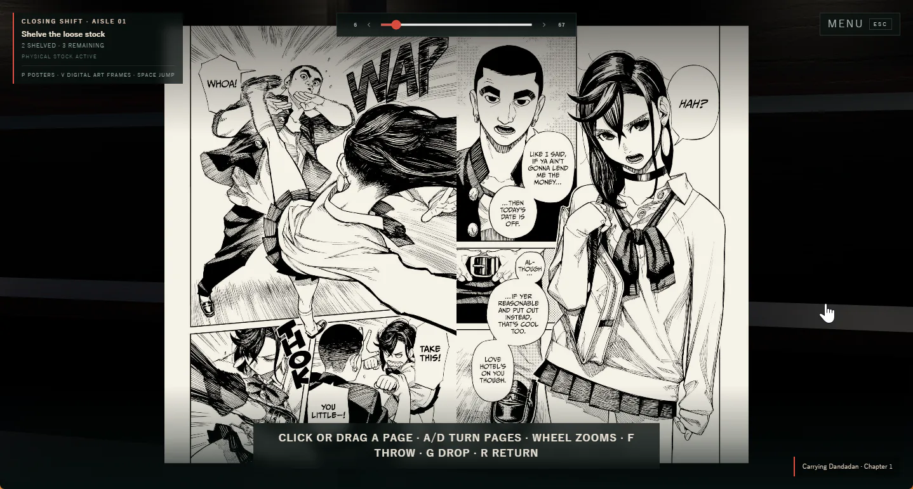
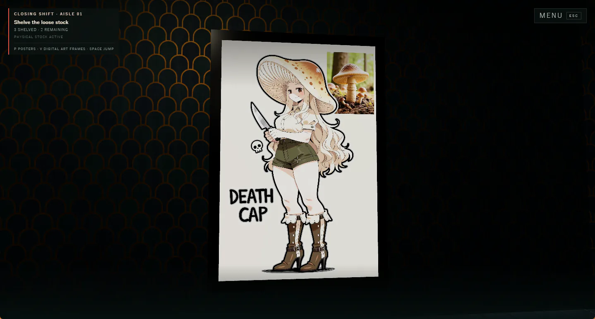
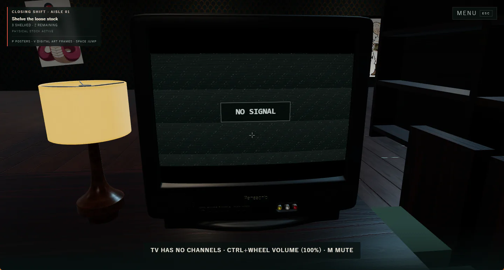

# Afterleaf



Afterleaf is a local-first, three-dimensional manga library: You play as a
manga shop proprietor who is re-shelving their collection after an earthquake.
Every book is readable! Make the space yours with posters, digital art frames, and TVs.

## Prerequisites

Install the latest version of [Bun](https://bun.sh/) and use a current
Chrome/Chromium browser. Then install dependencies and start Afterleaf:

```sh
bun install
bun run dev
```

### Strongly recommended media tools

Install both [`yt-dlp`](https://github.com/yt-dlp/yt-dlp) and
[`ffmpeg`](https://ffmpeg.org/) and ensure both commands are available on
`PATH`. They are required for importing a pasted video URL into an in-shop
television. Afterleaf asks yt-dlp for a Chrome-compatible MP4/WebM and may need
ffmpeg to merge separate video and audio streams or remux the result.

Keep yt-dlp current. One supported installation method is:

```sh
python -m pip install --upgrade --pre "yt-dlp[default,curl-cffi]"
```

The `curl_cffi` extra provides browser-like TLS impersonation, which can avoid
YouTube rejecting yt-dlp's request before cookies or browser profiles are
involved. Verify it is available with `yt-dlp --list-impersonate-targets`.

On Windows, first check `python --version`. Only if Python is unavailable,
install it from PowerShell, then close and reopen PowerShell so the new command
is available:

```powershell
winget install --exact --id Python.Python.3.13 --source winget
```

With Python available, install yt-dlp with impersonation support:

```powershell
python -m pip install --upgrade --pre "yt-dlp[default,curl-cffi]"
```

Close and reopen PowerShell once more before starting Afterleaf, then confirm
that `yt-dlp --list-impersonate-targets` lists concrete browser targets. Avoid
installing the separate `yt-dlp.yt-dlp` winget package alongside this version,
since it may take precedence on `PATH` without the Python optional dependencies.

The [yt-dlp installation guide](https://github.com/yt-dlp/yt-dlp/wiki/Installation)
lists standalone binaries and platform package options. Install ffmpeg through
your operating system's package manager or from its official builds.

### Optional provider fallback

Docker is optional. It is only needed when running a local
[FlareSolverr](https://github.com/FlareSolverr/FlareSolverr) fallback for
provider requests rejected by Cloudflare. See the
[content seeding guide](docs/CONTENT_SEEDING.md#synchronize-a-local-nhentai-catalog)
for setup and configuration.

## Shared world save

The shop world is saved on the Afterleaf server at `content/world-save.json`.
A browser waits for that shared save before creating the shop scene. World
state is not duplicated into browser local storage.

World saves are validated, written atomically as human-readable JSON, submitted
in order, and normally checkpointed at most once every ten seconds. Leaving the
shop flushes pending changes immediately. Any browser that opens Afterleaf from
the same server origin restores the shared copy, including browsers on another
machine. Concurrent sessions are not live-synchronized; the most recently
received save becomes the state restored by later connections.

## Paste anything into the shop

Afterleaf turns clipboard pastes into content imports:

- **Books:** Plugin providers can expose paste handlers for URLs. If you paste a URL for a provider
  that Afterleaf supports into the game, the matching publication will be fetched and added
  to the library.
- **Posters:** Press `P` to enter poster placement, aim at a wall or shelf end,
  then paste an image.
- **Digital art frames:** Press `V`, aim at a frame (or choose a channel), and
  paste an image. Press `N`, name a new channel, and paste its first image in
  the dialog to create it.
- **Television:** Aim at the TV and paste an HTTP or HTTPS video URL. Any URL
  supported by [yt-dlp](https://github.com/yt-dlp/yt-dlp) can be used, including
  supported video pages as well as direct video files. Press `N`, name a new
  channel, and paste its first video URL in the dialog to create it.

The poster, art-frame, and TV workflows are described in more detail below.

## Books





Place local book archives beneath `content/books`, grouped by their reading
format:

```text
content/books/
  comics/  # left-to-right
    My Comic.cbz
  manga/   # right-to-left
    My Manga.cbr
```

The `comics` and `manga` directories set reading direction recursively, so books
may be organized into further subdirectories. Archive files remain in place;
generated manifests and shelf images are written beneath
`content-sources/catalog`.

Books can also be fetched through content-provider plugins. Afterleaf discovers
trusted local plugins from `content-plugins` and paths listed in
`AFTERLEAF_CONTENT_PLUGIN_PATHS`; see the
[content-provider plugin documentation](docs/CONTENT_PROVIDERS.md) for the
installation layout and runtime contract. Contributors implementing a provider
should also follow the
[provider implementation instructions](src/content/providers/AGENTS.md).

## Shop posters

Put poster images anywhere beneath `content/posters`. Afterleaf
discovers valid images recursively and converts them to browser-ready WebP at
the local content boundary, so the source filename extension and image encoding
do not need to match the shop's runtime format. Images with alpha transparency
retain it, allowing posters to be used as cutout stickers.

Additional poster roots can be listed in `posterPaths` in
`afterleaf.library.json`. Changes to configured roots are picked up by the
running local server; pasted posters are always saved to the default repo
folder.

The running shop refreshes the poster catalog every three seconds, so newly
added images become available without refreshing the page or restarting the
development server.

In the shop, press `P` to enter poster placement, then use `Q`/`E` for the
previous/next image. Aim at a wall or shelf end, use the mouse wheel to resize
while preserving the image's aspect ratio, and click to place it. Hold `Shift`
while using the wheel to rotate it within the wall plane. Press `P` or `G` to
exit placement.

While poster placement is active, paste a clipboard image to import it. The
local server auto-rotates it, fits it within 2048×2048, converts it to sRGB WebP
while preserving alpha transparency, and atomically saves it beneath
`content/posters`. Conversion continues if placement is exited; if it remains
active, the converted poster becomes the current preview as soon as it is
ready. Aim at an already placed poster and press `E` to move it or `G` to remove
it. Poster placement, size, and rotation are stored with the rest of the
persistent shop state.

## Digital art frames



Digital art frames (also called digital picture frames) display local image
channels from `content/art-frames`. Each immediate child
directory is a channel, and each image directly inside it is part of that
channel:

```text
afterleaf/
  content/
    art-frames/
      night-scenes/
        rainy-alley.png
        closing-train.jpg
```

Additional channel roots can be listed in `artFramePaths` in
`afterleaf.library.json`. Changes to configured roots are picked up by the
running local server; pasted art remains in the default repo folder.

Afterleaf discovers images by content and serves browser-ready WebP derivatives
limited to 2048 pixels on their longest edge. Pasted originals are saved
unchanged; their lower-resolution display derivative is generated in memory and
is not saved beside the source. Hidden files, symlinks, nested directories,
unsupported files, and empty channels are ignored. The running shop refreshes
the catalog every three seconds.

Press `V` to place a digital art frame. Use `Q`/`E` to switch channels, `F`/`G`
to select an image within the current channel, the wheel to resize, and
`Shift`+wheel to rotate. The initial image locks the physical screen aspect
ratio. Later images never resize the frame: `contain` shows the entire image
with letterboxing, while `cover` fills the screen with a centered crop. Image
changes use a smooth 0.8-second crossfade between two textures in one persistent
self-lit display material. The next shuffled image is decoded and uploaded
ahead of time to keep the transition smooth. Press `R` while placing to switch
between fit modes and `I` to cycle the slideshow timer through off, 10 seconds,
30 seconds, 1 minute, and 5 minutes.

While frame placement is active, paste a clipboard image to optimize it and add
it to the currently selected channel. Press `N` to name a new channel, then
paste its first image in the dialog. The paste creates its folder beneath
`content/art-frames` and becomes the channel's first image. A moved frame keeps
its locked physical aspect ratio when its displayed image is replaced by a
paste.

Aim at a placed frame and press `E` to move it or `G` to remove it. Press `C` to
change channel, `F` to shuffle immediately, `R` to switch contain/cover, or `T`
to change its timer. Paste while aiming at a frame to add the image to its
current channel and display it immediately. Press `N` while aiming at it to name
a new channel, then paste that channel's first image in the dialog. Each frame
persists its channel, current image, fit mode, timer, locked dimensions,
rotation, and position.

## Television channels



The in-shop television plays local `.mp4` and `.webm` files from named channel
directories. From the repository root, create a directory beneath
`content/channels` and put videos directly inside it:

```text
afterleaf/
  content/
    channels/
      late-night-anime/
        episode-01.webm
        station-ident.mp4
```

Additional TV channel roots can be listed in `tvChannelPaths` in
`afterleaf.library.json`. Changes to configured roots are picked up by the
running local server; pasted/downloaded videos remain in the default repo
folder.

The immediate directory name is the stable channel ID; lowercase hyphenated
names produce readable labels such as “Late Night Anime.” Nested directories,
hidden files, unsupported extensions, and empty channels are ignored. The
container must use codecs supported by the target Chrome version.

The running game refreshes the channel catalog about every three seconds, so
adding or removing a video does not require a restart. For a large copy, use an
unsupported temporary suffix such as `.webm.part` and rename the completed file
to `.webm` afterward so the TV never discovers a partial file.

While aiming at a television, paste an HTTP or HTTPS video URL to download that
single video into the television's selected channel. Afterleaf passes the URL to
`yt-dlp`, stages its intermediate files outside the channel, and publishes the
completed `.mp4` or `.webm` atomically. Playlists and live streams are not
imported. When the download finishes, the television switches to the new video
if it is still tuned to the channel that received the import.

Press `N` while aiming at a television to name a new channel, then paste its
first video URL in the dialog. The successful download creates the channel and
tunes that television to it.

`yt-dlp` and `ffmpeg` must be available on `PATH`. Install and keep yt-dlp
current in your preferred Python environment:

```sh
python -m pip install --upgrade --pre "yt-dlp[default,curl-cffi]"
```

`content/channels` is gitignored local content. See [the television guide](docs/TV.md#adding-custom-channels)
for playback, shuffle, aspect-ratio, spatial-audio, and interaction details.

## Library management

Afterleaf's normal library workflow is UI-first. Add local media, open the
Escape menu, and choose **Import & scan**. That one operation:

1. discovers configured archives and image folders;
2. creates or refreshes local publication metadata;
3. builds and activates an immutable library snapshot; and
4. injects newly available books into the running shop.

No Bun command is required for ordinary importing or rescanning.

### Supported local media

Each archive or image folder is one publication.

| Input         | Extensions                                | Notes                                                                                                                     |
| ------------- | ----------------------------------------- | ------------------------------------------------------------------------------------------------------------------------- |
| ZIP archives  | `.cbz`, `.zip`                            | ZIP storage and Deflate compression are supported.                                                                        |
| RAR archives  | `.cbr`, `.rar`                            | RAR 4 and RAR 5 are supported through the bundled WASM reader. Password-protected and multi-volume archives are rejected. |
| Image folders | `.avif`, `.jpeg`, `.jpg`, `.png`, `.webp` | Images are discovered recursively and sorted naturally by relative path.                                                  |

Afterleaf validates archive paths, duplicate names, encryption, entry counts,
entry sizes, total expanded size, and compression ratios before accepting an
archive. Symbolic links inside scanned media trees are skipped.

### Default library folders

From the repository root, place archives under:

```text
content/books/
  comics/
    My Comic.cbz
  manga/
    Another Book.cbr
```

Place unpacked publications under `content-sources/catalog`, with one folder per
publication:

```text
content-sources/catalog/
  My Image Folder Comic/
    001.jpg
    002.jpg
    003.jpg
```

**Import & scan** recognizes both layouts. Image folders receive a
`publication.json` manifest automatically. Later scans refresh the managed image
list when pages are added, replaced, or removed while preserving edited title,
tag, and other publication metadata.

Archives remain in their source location. Afterleaf stores only their manifest
and generated shelf images in `content-sources/catalog`; reader pages are
decompressed and converted on demand. ZIP pages are read directly, while a
requested RAR page uses an isolated temporary extraction that is removed after
the page is read. Recent converted pages share a bounded 128 MiB memory cache.

### Additional content locations

Edit `afterleaf.library.json` beside this README to add content stored elsewhere.
Every property is an array accepting zero or more paths, and every configured
path is additive to its default repo folder. Put books in `comicPaths` or
`mangaPaths` to set their reading direction:

```json
{
  "comicPaths": ["/mnt/d/Comics"],
  "mangaPaths": ["/mnt/e/Manga"],
  "tvChannelPaths": ["/mnt/d/Afterleaf/TV"],
  "posterPaths": ["/mnt/d/Afterleaf/Posters"],
  "artFramePaths": ["/mnt/d/Afterleaf/Art Frames"]
}
```

Copy the tracked example before adding private paths. The local config is
gitignored so machine-specific paths are not committed:

```sh
cp afterleaf.library.example.json afterleaf.library.json
```

| Property         | Default repo content   |
| ---------------- | ---------------------- |
| `comicPaths`     | `content/books/comics` |
| `mangaPaths`     | `content/books/manga`  |
| `tvChannelPaths` | `content/channels`     |
| `posterPaths`    | `content/posters`      |
| `artFramePaths`  | `content/art-frames`   |

Each `comicPaths` or `mangaPaths` entry may point to:

- one `.cbz`, `.zip`, `.cbr`, or `.rar` file;
- a directory containing archives at any depth; or
- a directory containing one immediate subfolder per image-folder publication.

If a configured book directory itself contains images, it is treated as one
publication. The old `mediaPaths` property remains accepted for migration but
leaves direction unspecified. TV and art-frame roots use the same named-channel layout as their
default folders; poster roots are scanned recursively. Relative paths are
resolved from the repository root; absolute paths use the filesystem syntax of the
runtime starting Afterleaf. For example, use `/mnt/d/...` when running Bun in
WSL and `D:/...` when running it on Windows.

Visual-media paths are optional mounts. Missing TV, poster, or art-frame roots
contribute no content, and the game's normal catalog refresh discovers them
again if they are later remounted. A missing configured book path is handled
more conservatively: Afterleaf shows a red startup warning and locks library
scan/fetch operations so a partial source set can never replace the current
snapshot. An empty configured book root is treated as unavailable too, covering
mount points whose underlying empty directory remains after an unmount.
Remounting the path clears the warning and unlocks updates.

Restart the local server after changing the configured visual-media path lists.
After changing `comicPaths`, `mangaPaths`, or their books, choose **Import & scan** again. The
browser receives only the number of unavailable book roots, never their
filesystem paths.

### Names, languages, and reading direction

Archive and image-folder names can include `[English]` or `[Japanese]`.
English is the fallback when no language hint is present. Recognized Chinese,
Korean, and other unsupported-language hints are skipped rather than relabeled.

Reading direction is independent of language. Add `[LTR]` or `[RTL]` to a media
name, or place archives beneath a `comics/` or `manga/` directory. Comics are
left-to-right and manga are right-to-left; these direction directories apply
recursively. Conflicting folder and filename directions reject
the affected archive. Without a direction hint, Afterleaf uses the player's
configured default.

Names resembling `Comic Name 2026-07` or `Comic Name 42` are recognized as
magazine families and receive structured issue metadata.

### Updating and removing publications

- Add media, replace an archive in place, or change files in an image folder,
  then choose **Import & scan**. Existing user-edited metadata is preserved.
- Moving an archive into or between `comics/` and `manga/` directories
  updates its source path and direction on the next scan.
- Discarding a publication in the shop permanently blacklists its publication
  ID, so later scans do not bring it back. The blacklist is stored at
  `content-packs/library/publication-blacklist.json`.
- Deleting an archive beneath the default in-repo `content/books` folder removes
  its prepared catalog entry on the next **Import & scan**. Configured external
  media paths are preserved when files or mounts disappear, so use the in-game
  discard flow for a durable removal from those sources.

Library snapshots live under `content-packs/library/snapshots`. Activation is
atomic: a failed import or build leaves the previous snapshot active. Unchanged
publication assets and shelf-atlas shards are hard-linked into the next snapshot
so routine rescans avoid redundant image work and disk usage.

### Optional CLI equivalents

The UI and CLI use the same ingestion pipeline. These commands are useful for
automation and diagnostics, but are not required for library management:

```sh
# The exact equivalent of Import & scan
bun run library:scan --write

# Add paths for this run without editing afterleaf.library.json
bun run library:scan --write \
  --media-path /mnt/d/Comics \
  --media-path /mnt/e/Manga/SingleBook.rar

# Preview archive importing without writing
bun run content:import-cbz

# Preview image-folder manifest preparation without writing
bun run content:prepare
```

`--media-path` is repeatable and additive to configured and default media paths.
See [the content seeding guide](docs/CONTENT_SEEDING.md) for standalone content
packs, acquisition providers, limits, and the complete catalog format.
